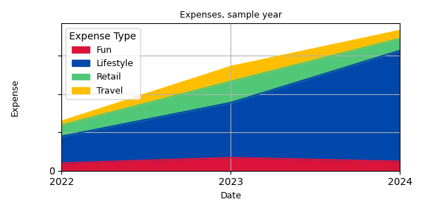

# personal finance reporting tool

A basic toolset for an encrypted, multi-pronged and in-depth personal financial analysis.
Imports financial data from bank & credit card statements, deduplicates, and outputs to a variety of easy to read graphs.

Every toolset in this series of scripts operates under following assumptions:

- File will be opened and updated
- File will be saved and closed
- Script will be run
- Script will open file when the run is complete

---

The encryption and decrytion relies on a user provided, terminal-untracked password.

---

To get started clone the repo & run the following (self documented)

```
python tools.py
```

---

To generate unit test reports

```
coverage run -m unittest discover
coverage report
```

---

Examples (non-comprehensive) of graph-output generated by a run of `python tools.py graph`





